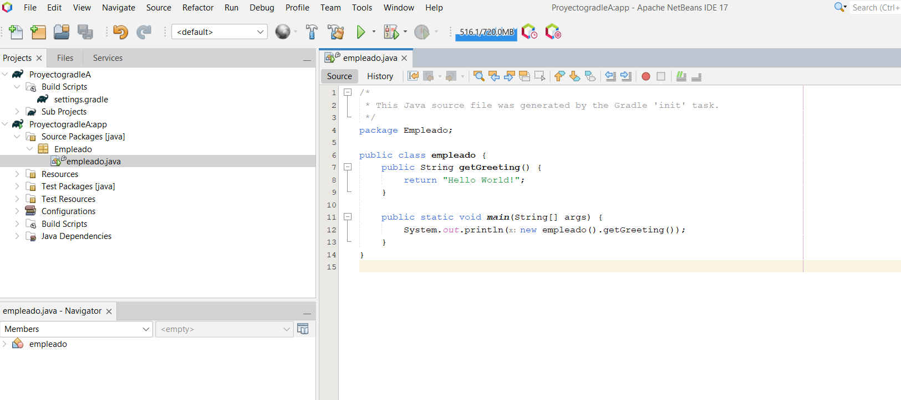

# Unidad 6
## Pruebas Unitarias

### 1. ¿Qué diferencia existe entre las pruebas estáticas y dinámicas?
- Pruebas estáticas: Se realizan sin ejecutar el código y se enfocan en revisar y analizar los artefactos del software.
- Pruebas dinámicas: Se llevan a cabo con la ejecución del código y se centran en probar el comportamiento y funcionamiento del software en tiempo de ejecución.

### 2.¿Qué diferencia existe entre las pruebas de caja negra y caja blanca?
- Pruebas de caja negra: Se realizan sin conocer la estructura interna del software y se enfocan en probar la funcionalidad externa del sistema.
- Pruebas de caja blanca: Se llevan a cabo con conocimiento de la estructura interna del software y se centran en probar la lógica interna del sistema.

### 3. ¿Qué diferencia existe entre las pruebas funcionales y no funcionales?
- Pruebas funcionales: Verifican si el software cumple con los requisitos funcionales establecidos y si realiza correctamente las tareas esperadas.
- Pruebas no funcionales: Evalúan aspectos como rendimiento, usabilidad, seguridad y escalabilidad del software, más allá de su funcionalidad.

### 4.Nombra al menos 4 pruebas funcionales.
- Pruebas de casos de uso.
- Pruebas de regresión.
- Pruebas de integración.
- Pruebas de aceptación.

### 5.Nombra al menos 4 pruebas no funcionales.
- Pruebas de rendimiento.
- Pruebas de seguridad.
- Pruebas de usabilidad.
- Pruebas de escalabilidad.

### 6.¿Qué són las pruebas unitarias o pruebas de unidad?
- Pruebas unitarias o pruebas de unidad: Son pruebas realizadas a nivel de componentes individuales del software, como funciones, métodos o clases, se realizan para verificar que cada unidad funcione correctamente y cumpla con sus especificaciones. Las pruebas unitarias suelen ser automatizadas, se ejecutan frecuentemente durante el proceso de desarrollo y ayudan a identificar y corregir errores en etapas tempranas del ciclo de vida del software.

### 7.¿Qué són las pruebas de regresión?
- Pruebas de regresión: Son pruebas realizadas para asegurarse de que las modificaciones o correcciones realizadas en el software no hayan introducido nuevos errores en funcionalidades previamente implementadas y probadas.

### 8.¿Qué son las pruebas de integración?
- Pruebas de integración: Verifican la interacción entre diferentes componentes o módulos del software. Estas pruebas verifican la integración adecuada de las unidades individuales y aseguran que funcionen correctamente en conjunto. El objetivo es detectar y corregir problemas de interoperabilidad y asegurar la funcionalidad del sistema como un todo.

### 9.¿Qué son las pruebas de humo?
- Pruebas de humo: Comprueban rápidamente si una nueva versión del software está lo suficientemente estable para someterse a pruebas más exhaustivas, estas pruebas se centran en verificar que el software se pueda iniciar correctamente y realizar funciones básicas sin problemas significativos.

### 10.¿Qué son las pruebas alphae
- Pruebas alpha: Pruebas internas realizadas por el equipo de desarrollo antes del lanzamiento del software al público. estas pruebas se realizan en un entorno controlado y su objetivo es identificar problemas, recolectar comentarios y realizar ajustes antes del lanzamiento oficial.

### 11.¿Qué son las pruebas beta?
- Pruebas beta: Pruebas realizadas por usuarios finales en un entorno real antes del lanzamiento oficial del software,  los usuarios proporcionan retroalimentación sobre su funcionamiento, identificando errores o sugerencias de mejora.

### 12. ¿Qué son las pruebas de aceptación?
- Pruebas de aceptación: Verifican si el software cumple con los requisitos y expectativas del cliente o usuario final, se enfocan en validar la funcionalidad, usabilidad y comportamiento general del software antes de su implementación y aceptación definitiva.

### 13.Instala el plugin Gradle para Netbeans.

En las versiones mas recientes de netbeans se puede implementar gradle de forma nativa y oficial, por lo que no hace falta ningun plugin.

### 14. Crea un proyecto nuevo de tipo Single Gradle Project y nombre empleado, que contenga la clase principal Empleado.

